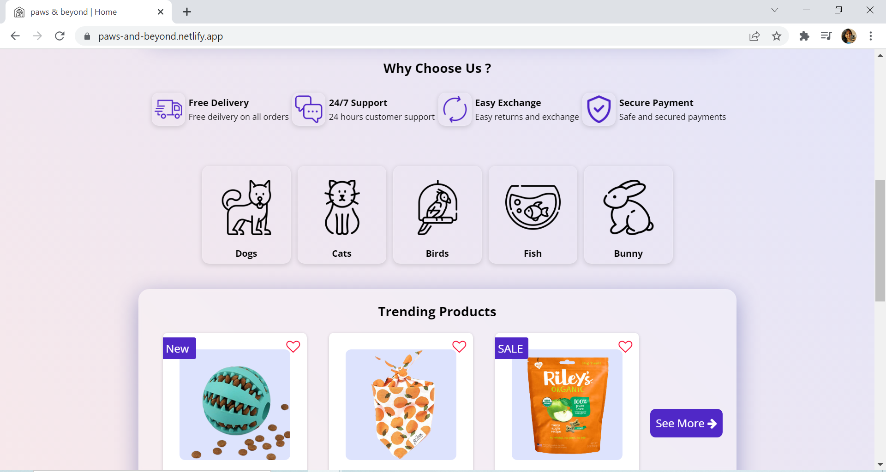
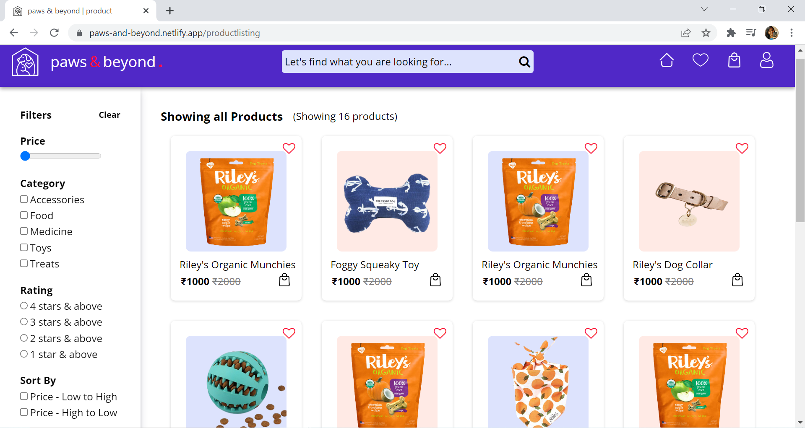
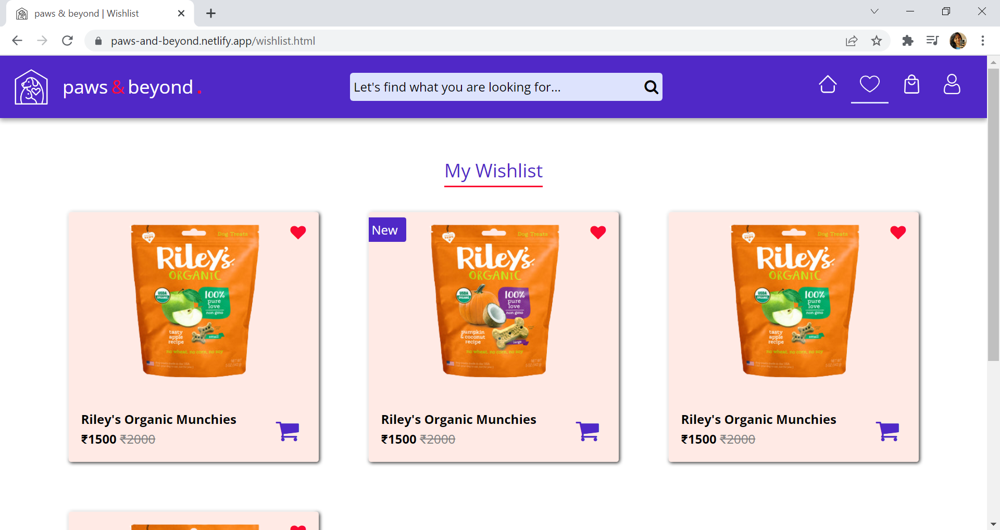
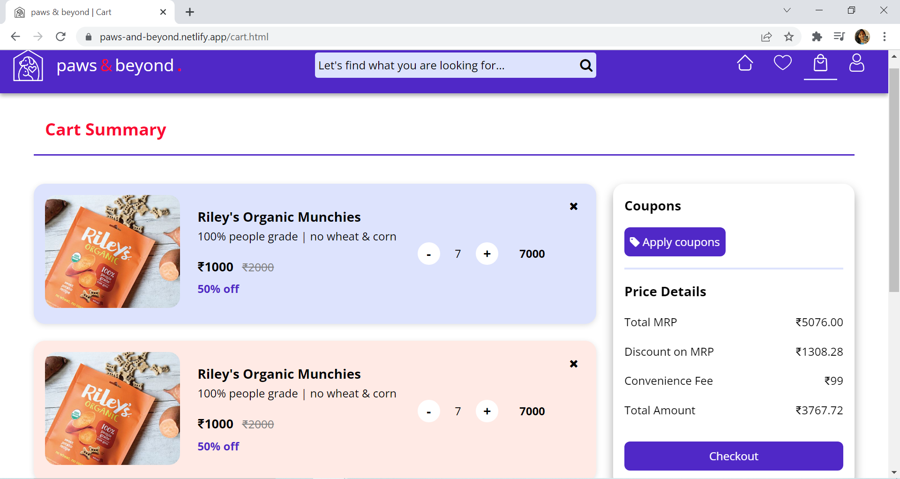
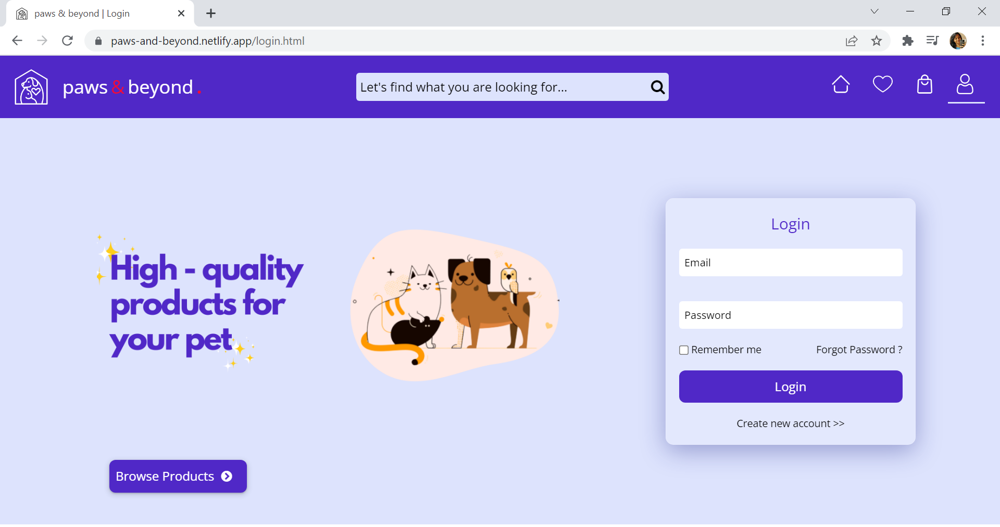

<h1>paws & beyond.</h1>
  

## Table of contents

- [Introduction](#introduction)
- [Screens](#screens)
- [Connect With Me](#connect-with-me)

## Introduction
" paws & beyond. " is an e-commerce application focused on selling pet prodcuts, built using HTML and CSS (at the moment).

## Screens
The application consists of the following screens :
- [Home Page](#home-page)
- [Prodcut Listing](#product-listing)
- [Wishlist](#wishlist)
- [Cart Management](#cart-management)
- [Login](#login)
- [Signup](#signup)

#### Home Page

#### Prodcut Listing

#### WishList

#### Cart Management

#### Login

#### Signup

## 👩🏽‍💻Connect with me

